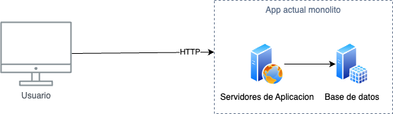
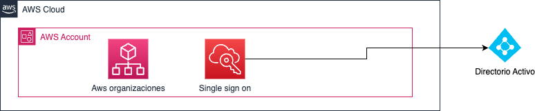

# Prueba Tecnica Nequi

En esta documentacion se resuleve la prueba tecnica para el cargo de Arquitecto de Infraestructura.

## Arquitectura inicial

El problema plantea una arquitectura con una aplicacion monolitica en uno o varios servidores y una persistencia local. El siguiente diagrama ilustra de forma simplificada la arquitectura actual

## Manejo de cuentas
Como primera medida se sugiere el uso de aws organizations para gestionar las cuentas y de ser posible utilizar single sign on para disminuir la administracion de usuarios y evitar que el usuario deba conocer muchas contraseñas.

## Arquitectura de Datos

El siguiente diagrama ilustra la persistencia necesaria para manejar la maquina de estados finitos.

- Entidad: Es la lista de clases y/o tipos de objectos posibles.
- Estados: Es la lista de estados definidos por entidad.
- TipoEstados: Esta tabla nos sirve para indicar si el estado es el inicial, por defecto, final o algun otro tipo que no visualizemos actualmente.
- EstadosPosibles: Es la lista de estados posible por estado, es decir de donde a donde puedo pasar.
- TipoDisparador: Esta tabla puede ser util para no solo ejecutar metodos sino tambien, llamar un webservice, lanzar un evento.Etc
- Reglas: Aqui se configura el estado inicial y el estado final.
- EstadosObjectos: Aqui se persiste el estado del objecto.
- HistoricosEstados: Aqui se guardan los estados por los que ha pasado el obejcto.

## Modelo de Clases
El siguiente diagrama de aplicacion ilustra el micro servicio para configurar estados por entidad, sus reglas y sus posibles estados.

El siguiente diagrama de clases ilustra a manera general como deberia funcionar la libreria.

## Propuesta de arquitectura orientada a Api y SDK

El siguiente diagrama ilustra una propuesta a manera de arquitectura de solucion para un api y/o sdk para el manejo de la maquina de estados utilizando la propuesta de base de datos y que todas las funciones las entregue por una api.

