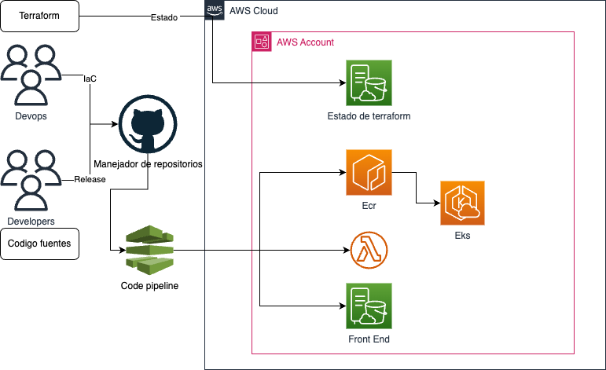

# Prueba Tecnica Nequi

En esta documentacion se resuleve la prueba tecnica para el cargo de Arquitecto de Infraestructura.

## Arquitectura inicial

El problema plantea una arquitectura con una aplicacion monolitica en uno o varios servidores y una persistencia local. El siguiente diagrama ilustra de forma simplificada la arquitectura actual

## Manejo de cuentas
Como primera medida se sugiere el uso de aws organizations para gestionar las cuentas y de ser posible utilizar single sign on para disminuir la administracion de usuarios y evitar que el usuario deba conocer muchas contraseñas.

## Arquitectura para el manejo de devops

El siguiente diagrama ilustra la propuesta para el despliegue de infraestructura y el despliegues continuo de las palicaciones

- Github: Representa el versionador de codigo fuente(puede ser cualquiera basado en git).
- Terraform: Para la construccion de la infraestructura como codigo, de igual manera usara un bucket de s3 para el manejo del estado de la infraestructura.
- Pipeline: se requieren pipeline para desplegar tanto la infraestructura asi como para desplegar en EKS, Lambda y/o s3.

## Arquitectura de referencia
El siguiente diagrama de aplicacion ilustra el micro servicio para configurar estados por entidad, sus reglas y sus posibles estados.

El siguiente diagrama de clases ilustra a manera general como deberia funcionar la libreria.

## conclusiones

El siguiente diagrama ilustra una propuesta a manera de arquitectura de solucion para un api y/o sdk para el manejo de la maquina de estados utilizando la propuesta de base de datos y que todas las funciones las entregue por una api.

